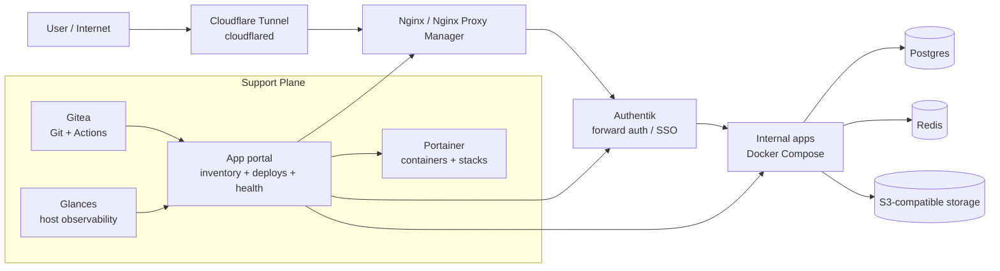
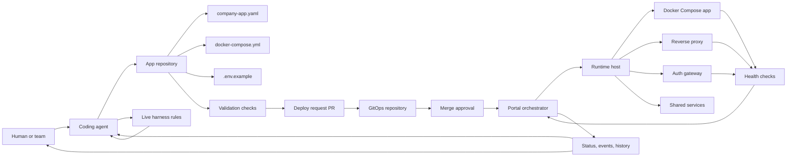

# Open Company App Harness

A lightweight, open source harness for creating, validating, and deploying internal company apps with coding agents, GitOps, Docker Compose, authentication, and health checks.

The project is designed for teams that want AI coding agents to build useful internal tools without turning production deployment into a collection of one-off scripts, copied workflows, and undocumented server state.

Internal tools are often small enough to build quickly but important enough to require ownership, authentication, repeatable deploys, health checks, and rollback paths. AI coding agents make the first part faster. This harness focuses on the second part: turning agent-built apps into operated software.

## What This Is

Open Company App Harness is a reference architecture and starter kit for:

- defining an operational contract for each app with `company-app.yaml`;
- validating app repositories before deployment;
- using GitOps for first-time deployment approval;
- running apps with Docker Compose;
- integrating with an internal Git server, reverse proxy, auth provider, and app portal;
- giving coding agents clear rules for how to prepare apps safely;
- recording deploy history, runtime state, health, and actionable failures.

It is not a hosted platform. It is a set of conventions, schemas, templates, and implementation building blocks that a company can adapt to its own infrastructure.

## Why It Exists

Coding agents can produce internal apps faster than most teams can safely deploy them.

Without a harness, each app tends to grow its own deployment script, fixed port, environment variable pattern, auth behavior, and README. That works for one app. It becomes fragile at ten apps and risky at fifty.

Open Company App Harness creates a thin control plane around agent-built apps:

- a manifest for intent;
- a template for repeatability;
- checks for confidence;
- GitOps for approval;
- an orchestrator for runtime state;
- a portal for visibility;
- rules that agents can follow without needing production access.

## Reference Open Source Stack

The default mental model is a small, self-hosted internal platform built from replaceable open source components.



The entry path is intentionally simple:

```text
cloudflared -> reverse proxy -> auth gateway -> app
```

The support plane keeps the environment operable:

- Gitea stores repositories and runs GitOps workflows.
- Portainer gives visibility into containers, images, volumes, and stacks.
- Glances exposes host-level resource usage.
- The app portal records app inventory, deploy history, health checks, and drift.
- Shared services such as Postgres, Redis, and object storage are optional but standardized.

Every box can be swapped. The harness cares about the contracts between them: Git repositories, app manifests, reverse-proxy routes, auth headers, health checks, and deploy events.

## Deployment Control Loop



The app repository says what should exist. The runtime host reveals what actually exists. The orchestrator compares both and records the difference.

## Core Idea

Every deployable app carries its operational contract in the repository:

```yaml
schema_version: 1

app:
  slug: example-app
  name: Example App
  owner_email: owner@example.com

runtime:
  type: docker-compose
  compose_file: docker-compose.yml
  service: app
  healthcheck:
    type: http
    path: /health
    expected_status: 200

deploy:
  enabled: true
  domain: example-app.internal.example.com
  port: auto
  env_file: .env
  env_example: .env.example

auth:
  required: true
  provider: forward-auth
  allowed_domains:
    - example.com
```

The harness validates that contract, checks the repository, and coordinates deployment through a controlled path.

## Operating Model

Open Company App Harness uses a two-stage deployment model.

### First deploy

1. A developer or coding agent creates an app from the template.
2. The app repository declares its contract in `company-app.yaml`.
3. Validation checks run without production secrets.
4. A deploy request pull request is opened in the GitOps repository.
5. Review and merge become the approval signal.
6. The orchestrator creates runtime state, proxy route, auth policy, environment, and health checks.

### Later deploys

After the app is onboarded, normal code changes can deploy from the app repository's default branch, as long as the app still satisfies the contract and platform checks.

## Suggested Stack

The reference stack assumes:

- Git server: Gitea, GitHub Enterprise, GitLab, or GitHub;
- reverse proxy: Nginx Proxy Manager, Traefik, Caddy, or nginx;
- auth: Authentik, Authelia, OAuth2 Proxy, or another forward-auth provider;
- runtime: Docker Compose;
- portal/orchestrator: an internal app that records apps, deploys, checks, health, and events.

These tools are intentionally replaceable. The contract matters more than the exact vendor.

## What Makes This Different

This project is intentionally smaller than a full platform-as-a-service and stricter than a pile of scripts.

- It keeps the app contract in Git, close to the code.
- It lets companies run on simple infrastructure first.
- It treats AI agents as contributors that need rules, feedback, and boundaries.
- It separates validation from deployment.
- It keeps production credentials in the runner or orchestrator, not in chat, manifests, or app repos.
- It makes health and deploy state visible to humans and agents.

## Advantages

### For small teams

- Start with one host and Docker Compose instead of a full Kubernetes platform.
- Get a repeatable path for internal apps without building a large platform team.
- Keep operational decisions visible in Git.

### For platform teams

- Standardize app metadata, ownership, auth, health, and deploy behavior.
- Make drift visible by comparing Git intent with runtime reality.
- Introduce stronger backends later without changing the app contract.

### For coding agents

- Give agents a clear contract instead of tribal knowledge.
- Let agents fix validation failures from actionable feedback.
- Avoid giving agents broad production access.
- Make generated apps easier to review because they follow the same shape.

### For security and operations

- Pull requests run checks without deploy credentials.
- New apps require auth by default.
- Port allocation can be centralized.
- Secrets stay out of manifests and `.env.example`.
- Destructive actions are outside the default automation path.

## Lessons Behind The Architecture

This harness grew from a practical pattern: agent-built apps become useful quickly, but they need a boring operational path to stay safe.

The key lessons:

- A template is not enough. Teams need a contract, checks, and a deploy path.
- A manifest beats scattered README instructions because it can be validated.
- GitOps is useful for first deploys because it creates an auditable approval moment.
- Agents should prepare and repair deployment artifacts, not silently mutate production.
- Health checks need to be part of the contract, not an afterthought.
- Auth should be the default for internal apps, with explicit exceptions.
- Automatic port allocation prevents slow, hidden conflicts.
- The portal should observe and compare state; Git should remain the source of app intent.
- The simplest workable runtime is often the right starting point, as long as the contract can outlive it.

## Repository Layout

```text
docs/                  Architecture, quickstart, GitOps flow, security
schemas/               JSON schemas for manifests and deploy requests
templates/app/         Starter files for a deployable internal app
templates/gitops-request/
examples/minimal-web-app/
docker/                Example compose for a local harness stack
packages/cli/          Placeholder for validation and workflow tooling
```

## Status

Early extraction. The first goal is to make the pattern easy to understand, install, and audit. The second goal is to provide a working CLI and a runnable local demo.

## Safety Principles

- Git is the source of truth for app intent.
- Pull requests validate without production secrets.
- Real deployment happens only after an explicit approval signal.
- App manifests never contain secret values.
- New apps use automatic port allocation by default.
- Internal apps should require authentication by default.
- The harness never deletes databases, volumes, repositories, stacks, or proxy routes automatically.
- Runtime changes should be previewable before they are applied.
- Agent-facing errors should explain the next fix, not just the failed check.

## Getting Started

Start with the docs:

- `docs/architecture.md`
- `docs/quickstart.md`
- `docs/llm-bootstrap.md`
- `docs/app-contract.md`
- `docs/gitops-flow.md`
- `docs/security.md`

Then inspect:

- `templates/app/`
- `examples/minimal-web-app/`

## Bootstrap With A Terminal-Connected LLM

The repository includes a bootstrap playbook for agents that can use a terminal:

```bash
cp bootstrap/repos.example.json local/repos.json
node scripts/bootstrap.mjs --plan --repos=local/repos.json
```

The script asks for company-specific values, writes an inspectable plan to `local/bootstrap-plan.md`, and defaults to plan mode. It only clones repositories or writes local secret config when run with `--apply`, and it only starts services when `--start` is also provided.

For non-interactive smoke tests:

```bash
node scripts/bootstrap.mjs --plan --defaults --repos=bootstrap/repos.example.json
```
